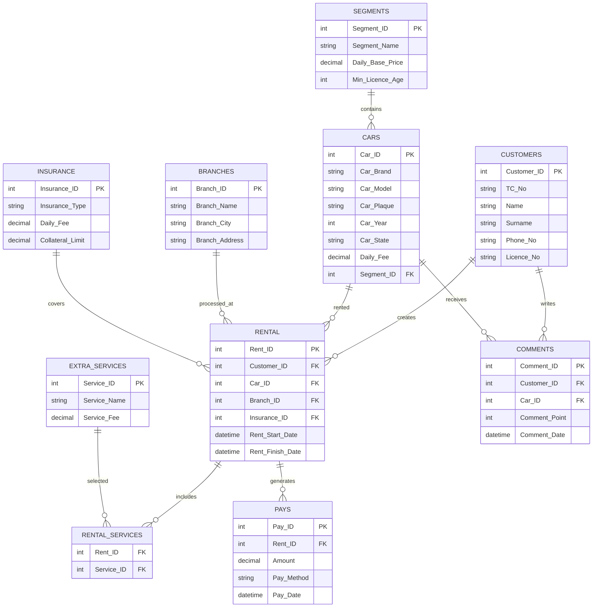

  APEXAUTO ARABA KİRALAMA OTOMASYONU
 
  **PROJE HAKKINDA**

   
   APEXAUTO,ASP.NET Core MVC ve Sql Server teknolojilerli kullanılarak geliştirilmiş bir araç kiralama otomasyon sistemidir.

   Günümüzde araç kiralama işlemlerinin manuel olarak yürütülmesi müşteri kayıtlarının, araç bilgilerinin, ödeme süreçlerinin ve kiralama işlemlerinin takibini zorlaştırmaktadır.Bu durum veri kayıplarına, işlem hataların ve zaman kaybına neden olabilmektedir.

   Proje kapsamında müşterilerin araç kiralama işlemlerini gerçekleştirebilmesi, araçların yönetilebilmesi,ödeme işlemlerinin takip edilmesi ve kiralama süreçlerinin dijital ortamda yönetilebilmesi için bir otomasyon sistemi geliştirilmiştir.Buradaki işlemler bir veri tabanı üzerinden kontrol edilebilmeltedir.

  **YAPILAN ARAŞTIRMALAR**
  
  • Araç kiralamasistemine uygun bir veritabanı oluştururken veri tekrarının önlenmesi ve veri bütünlüğünün korunması amacıyla normalizasyon kuralları incelenmiş,tablolar 5. Normal Forma (5NF) uygun olcak şekilde tasarlanmıştır.
  
  • SQL Server üzerinde veritabanı oluştururken "Database already exists", "Object already exists" gibi hatalarla karşılaşılmıştır.Bu hatalar mevcut veritabanı nesnelerinin kontrol edilmesi, doğru veritabanının seçilmesi ve SQL sorgularındaki tablo takma adlarının doğru kullanılmasıyla çözüme ulaşmıştır.
  
  • Web uygulaması geliştirme aşamasında ASP.NET Core MVC mimarisi araştırılmıştır.Model, View ve Controller yapılarının görevleri incelenmiş ve proje bu mimariye uygun şekilde yapılmıştır.Ayrıca Entity Framework Core kullanılarak SQL Server veritabanı ile web uygulaması arasında bağlantı kurulması araştırılmıştır.

  • Projenin sürüm kontrolü ve ekip çalışmasına uygun şekilde geliştirilebilmesi için Git ve GitHub teknolojileri incelenmiştir.GitHub üzerinde depo oluşturma, ekip arkadaşlarını davet etme, proje dosyalarını yükleme ve README dosyası hazırlama konularında araştırmalar yapılmıştır.
  
  • Kullanıcı arayüzünün geliştirilmesi sırasında HTML,CSS,JavaScript teknolojileri araştırırlmıştır.

  • Bu araştırmalar sonucunda araç kiralama süreçlerini dijital ortamda yönetebilen, SQL Server veritabanı ile entegre çalışan ve ASP.NET Core MVC mimarisi kullanılarak geliştirilen bir araç kiralama otomasyonu ortaya çıkmıştır.

   **AKIŞ ŞEMASI**

  ```mermaid
flowchart TD

A([Başla]) --> B[Ana Sayfa]
B --> C[Araçları Listele]
C --> D[Araç Seç]
D --> E[Müşteri Bilgileri Gir]
E --> F[Sigorta Seç]
F --> G[Ek Hizmet Seç]
G --> H[Kiralama Kaydı Oluştur]
H --> I[Ödeme İşlemi]
I --> J[Veritabanına Kaydet]
J --> K[Araç Durumunu Güncelle]
K --> L([Bitiş])
```

  **YAZILIM MİMARİSİ**

 **Sistem Katmanları**

 **Kullanıcı Arayüzü (View Katmanı)**

  Bu katman kullanıcıların sistem ile etkileşime geçtiği bölümdür.

   Kullanılan Teknolojiler:
  
  • HTML5
  
  • CSS3
  
  • Bootstrap
  
  • JavaScript
  Bu katmanda araç listeleme,araç kiralama,müşteri işlemleri ve ödeme ekranı yer almaktadır.

  **Controller Katmanı**

   Controller katmanı kullanıcıdan gelen istekleri karşılar ve gerekliişlemleri gerçekleştirir.

   Görevleri:
  
  • Kullanıcı isteklerini almak
  
  • Verileri işlemek
  
  • Veritabanı işlemlerini başlatmak
  
  • Sonçları View katmanına göndermek

   **Model Katmanı**

   Model katmanı sistemde kullanılan veri yapılarını temsil eder.

   Örnek Modeller:
  
  • Customer
  
  • Car
  
  • Rental
  
  • Branch

  Bu katman Entity Framework Core ile SQL Server veritabanı arasında veri aktarımını sağlamaktadır.

   **Veri Erişim Katmanı (Entity Framework Core)**

   Bu katman uygulama ile SQL Server arasındaki iletişimi sağlar.

   Görevleri:
  
  • Veritabanı bağlantısı kurmak
  
  • Veri eklemek
  
  • Veri silmek
  
  • Veri güncellemek
  
  • Veri sorgulamak

  **Veritabanı Katmanı**

  Sitemin tüm verileri SQL Server üzerinde tutulmaktadır.

   Veritabanında:
  
  • Tablolar
  
  • Foreign Key ilişkileri
  
  • View'lar
  
  • Stored Procedure'ler
  
  • Triger'lar

  • Index'ler

  bulunmaktadır.

 **Yazılım Mimarisi Akışı**

 Kullanıcı -> View -> Controller -> Entity Framework Core -> SQL Server

 SQL Server -> Entity Framework Core -> Controller -> View -> Kullanıcı

 Bu yapı sayesinde sistemin yönetilebilirliğİ,okunabilirliği ve geliştirilebilirliği artmıştır.
  


 **ER DİYAGRAMI**



 **GENEL YAPI**

   ApexAuto araç kiralama süeçlerinin dijital ortamda yönetilebilmesi amacıyla geliştirilmiş web tabanlı bir araç kiralama otomasyon sistemidir.Proje kapsamında müşterilerin araçları görüntüleyebilmesi,araç kiralama işlemlerini gerçekleştirebilmesi,sigorta ve ek hizmet seçeneklerinden yararlanabilmesi ve ödeme işlemlerini tamamlayabilmesi hedeflenmiştir.

 Sistem ASP.NET Core MVC [2] mimarisi kullanılarak geliştirilmiş olup,verilerin saklanması ve yönetilebilmesi için SQL Server veritabanı kullanılmıştır.Veritabanı tasarımında [1] veri tekrarını önlemek ve veri bütünlüğünü sağlamak amacıyla normalizasyon kuralları [10] dikkate alınmıştır.Müşteri,araç,şube,sigorta,kiralama,ödeme,yorum ve ek hizmetler süreçleri ilişkisel veritabanı yapısı içerisinde modellenmişir. 

 Proje içerisinde veri erişim işlemlerinin yönetilebilmesi için Entity Framework Core [3] kullanılmıştır.Ayrıca veritabanı tarafında performansı ve iş süreçlerini iyileştirmek amacıyla View,Stored Procedure,Trigger ve Index yapıları kullanılmıştır.Bu sayede araç kiralama işlemlerinin daha hızlı ve kontrollü bir şekilde yürütülmesi sağlanmıştır. 

 Kullanıcı arayüzü HTML,CSS,Bootstrap ve JavaScript teknolojileri [6],[7]kullanılarak geliştirilmiştir.Böylece kullanıcıların sistem üzerinde kolay ve anlaşılır bir şekilde işlem yapabilmesi amaçlanmıştır.

 Projenin geliştirme sürecinde Git ve GitHub kullnılarak sürüm kontrolü sağlanmış,proje dökümantasyonu hazırlanmış ve veritabanı yapısı ER diyagramı [8] ile modellenmiştir.

 Sonuç olarak ApexAuto,araç kiralama işletmelerinin müşteri,araç,ödeme ve kiralama süreçlerini merkezi bir sistem üzerinden yönetebilmesine olanak sağlayan,veritabanı ve web teknolojilerinin birlikte kullanıldığı kapsamlı bir otomasyon projesidir.

 **REFERANSLAR**

 [1] Microsoft Corporation, "SQL Server Documentation", Microsoft Learn. Erişim Adresi: https://learn.microsoft.com/sql

[2] Microsoft Corporation, "ASP.NET Core Documentation", Microsoft Learn. Erişim Adresi: https://learn.microsoft.com/aspnet/core

[3] Microsoft Corporation, "Entity Framework Core Documentation", Microsoft Learn. Erişim Adresi: https://learn.microsoft.com/ef/core

[4] GitHub, "GitHub Documentation". Erişim Adresi: https://docs.github.com

[5] Stack Overflow, Yazılım geliştirme sürecinde karşılaşılan problemlerin çözümünde yararlanılan topluluk platformu. Erişim Adresi: https://stackoverflow.com

[6] W3Schools, HTML, CSS ve JavaScript öğrenme kaynağı. Erişim Adresi: https://www.w3schools.com

[7] Bootstrap Team, "Bootstrap Documentation". Erişim Adresi: https://getbootstrap.com/docs

[8] diagrams.net (Draw.io), ER Diyagramı ve Akış Şeması oluşturma aracı. Erişim Adresi: https://app.diagrams.net

[9] Oracle Corporation, "MySQL ve Veritabanı Tasarım Kaynakları". Erişim Adresi: https://dev.mysql.com/doc

[10] Silberschatz, A., Korth, H. F., & Sudarshan, S., "Database System Concepts", McGraw-Hill Education.

